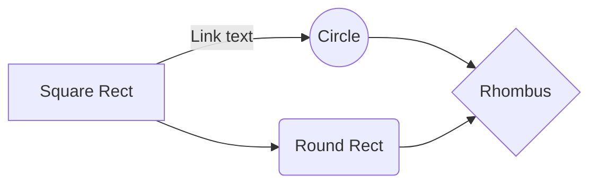

# OctoryConfigMaker

Hopefully some day this script will write a script that can configure Octory.

This is a test

```mermaid
graph LR
A[Square Rect] -- Link text --> B((Circle))
A --> C(Round Rect)
B --> D{Rhombus}
C --> D
```
